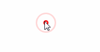

##clickBubble
clickBubble is a simple jquery plugin.
Clicking on the target area, an animated bubble-liked circle will appear and fade soon.



##Usage
include jQuery and the plugin on the page

```html
<script type="text/javascript" src="js/jquery-1.12.3.min.js"></script>
<script type="text/javascript" src="js/jquery.clickBubble.min.js"></script>
```

use clickBubble funciton on the target area

```html
<script>
	$('html').clickBubble();
</script>
```

4 options can be costumized:

* color: code or color name, '#ff0000' or 'red'
* size: size of bubbles
* time: bubble fade time
* borderWidth: width of bubble border

```html
<script>
	$('html').clickBubble({
		color: 'red',
		size: 40,
		time: 1000,
		borderWidth: 3
	})
</script>
```
